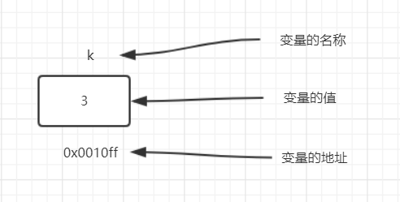

# 第二章 数据类型、运算符和表达式

## C数据类型

### 基本类型

基本数据类型主要的特点是，其值不可以再分解为其他类型，也就是说，基本数据类型是自我说明的

### 构造数据类型

构造数据类型是根据已定义的一个或多个数据类型用构造的方法来定义的，也就是说， 一个构造类型的值可以分解成若干个成员或元素的，每个成员都是一个基本数据类型或又是一个构造类型。在C语言中，构造类型有以下几种：

- 数组类型
- 结构体类型
- 共用体类型


### 指针类型

指针是一种特殊的，同时又是具有重要作用的数据类型，其值用来表示某个变量在内存储器中的地址，虽然指针变量的取值类似于整型量，但这是两个类型完全不同的量，因此不能混为一谈


### 空类型

在调用函数时，通常应向调用者返回一个函数值，这个返回的函数值是具有一定的数据类型的，樱扎函数定义及函数说明中给予说明，

如定义函数`int max(int a,int b);`其中`int`类型说明符即表示该函数的返回值为整型。但是，也有一类函数，调用后并不需要向调用者返回函数值，这种函数可以定义为 **空类型**，其类型说明符为`void`


## 常量与变量

对于基本数据类型量，按其取值是否可以改变又分为常量和变量两种

在程序执行过程中，其值不发生改变的量称为常量，其值可变的量称为变量

在程序中，常量时可以不经说明而直接使用的，而变量则必须先定义后使用。

> 在程序执行过程中，其值不发生的改变的量称为常量

### 符号常量

用标识符代表一个常量，在C语言中，可以用一个标识符来表示一个常量，称之为符号常量，符号常量在使用之前必须先定义。其一般形式为

```c
#define 标识符 常量
```

其中，`#define`是一条预处理命令，称为 **宏定义命令**，其功能是把该标识符定义为其后的常量值。一经定义，以后在程序中所有出现该标识符的地方均代之以该常量值

> 习惯上符号常量的标识符用大写字母，变量标识符用小写字母，以示区别。 


符号常量的使用范例

```c
#include<stdio.h>
// 用标识符代表一个常量，称为符号常量
#define PRICE 30

int main(){
    // 符号常量与变量不同，其值在其作用域内不能改变，也不能再被复制
    int num,total;
    num = 10;
    total = num * PRICE;
    printf("total=%d",total);
    return 0;
}

```

使用符号常量的好处是

- 含义清楚
- 能做到 **一改全改**

### 变量

值可以改变的量称为变量，一个变量应该有一个名字，在内存中占据一定的存储单元。变量定义必须放在变量使用之前，一般放在函数体的开头部分，要区分变量名和变量值是两个不同的概念

如 `int k = 3;`




### 整型常量的表示方法

整型常量就是整常数，在C语言中，使用的整型常数有八进制、十六进制和十进制三种

- 十进制整常数：十进制整常数没有前缀，其数码为0~9，==在程序中是根据前缀来区分跟中进制数的==，因此在书写常数时，不要把前缀弄错造成结果不正确，以下各个数字是合法的十进制整型常数

  237，-568

- 八进制整常数：八进制整常数必须以0开头，即以0作为八进制数的前缀，数码取值为0~7，八进制通常是无符号数。

  以下各个数字为合法的八进制数

  015(十进制为13)，0101(十进制为65)，0177777(十进制数为65535)

- 十六进制整常数： 十六进制整常数的前缀为0X或0x，其数码取值为0~9， A ~ F 或a ~f

- 整型常数的后缀：在16位字长的机器上，基本整型的长度也为16位，因此表示的数的范围也是有限定的。十进制无符号的整常数的范围为0 ~ 65535，有符号数为 -32768 ~ 32767，八进制无符号数的 表示范围为0 ~0177777 ，十六进制无符号数的表示范围为0X0 ~ 0XFFFF，如果是使用的数超过了上述范围，就必须要用长整型数来表示，长整型数是用后缀`L`或`l`来表示的


### 整型变量

内存中的二进制存储，数值是以补码表示的

- 正数的补码和原码相同
- 负数的补码，将该数的绝对值的二进制形式按位取反再加1

> 求 -10 的补码

10的原码`00001010`

取反 `11110101`

加1得到-10的补码 `11110110`

### 整型变量的分类

- 基本型，类型说明符为`int`，在内存中占用4个字节
- 短整型，类型说明符为`short int`或`short`，所占字节和取值范围均与基本类型相同
- 长整型，类型说明符为`long int`或long,在内存中占4个字节
- 无符号型，类型说明符为`unsigned`

### 实型数据

#### 实型常量的表示方法

实型也称为浮点型，实型常量也称为实数或者浮点数，在C语言中，实数只采用十进制，它有两种形式，十进制小数形式，指数形式

- 十进制数形式，有数码0 ~ 9 和小数点组成

- 指数形式，由十进制数加阶码标志“e” 或“E” 以及阶码组成，其一半形式为 a E n(a为十进制数，n为十进制整数)，如`2.1E5`表示 $2.1*10^5$

  > 标准C允许浮点数使用后缀，后缀为f或F，即表示该数为浮点数

#### 实型数据在内存中的存放形式

实型数据一般占4个字节（32位）内存空间，按照指数形式存储，实数3.14159在内存中的存放形式如下

| 符号 | 小数部分 | 指数部分 |
| ---- | -------- | -------- |
| +    | .314359  | 1        |

- 小数部分占的位数越多，数的有效数字越多，精度越高
- 指数部分占的位置越多，则能表示的数值范围越大


#### 实型变量的分类

单精度 `float`

双精度 `double`

长双精度 `long double`


#### 实型数据的舍入误差

由于实型变量是由有限的存储单元组成的，因此提供的有效数字总是有限的

```c
int main() {
    float a2,b2;
    a2 = 123456.789e5;
    b2 = a2 + 20;
    printf("%f\n",a2);
    printf("%f\n",b2);
    return 0;
}
```


### 字符型数据

字符型数据包括字符常量和字符变量

#### 字符常量

字符常量时用单引号括起来的一个字符，有如下特点

- 字符常量只能用单引号括起来，不能用双引号或其他括号
- 字符常量只能是单个字符，不能是字符串
- 字符可以是字符集中任意字符，但数字被定义为字符型之后就不能参与数值运算

#### 字符变量

字符变量用来存储字符常量，即单个字符，字符变量的类型说明符是`char`，字符变量类型定义的格式和书写规则都与整型变量相同

```c
char a,b;
```

#### 转义字符

转义字符是一种特殊的字符常量，转义字符以反斜线`\`开头，后跟一个或几个字符。转义字符具有特定的含义，不同于字符原有的意义，转移字符主要哟呵你过来表示那些用一般字符不便于表示的控制代码

#### 字符数据在内存中的存储形式以及使用方法、

每个字符变量被分配一个字节的内存空间，因此只能存放一个字符，字复值是以ASCII码的形式存放在变量的内存单元中


#### 字符串常量

字符串常量时又一对双引号括起来的字符序列，字符串常量和字符常量是不同的量，其区别主要是

- 字符常量是由单引号括起来，而字符串常量由双引号括起来
- 字符常量只能是单个字符，字符串常量则可以含一个或多个字符
- 可以把一个字符常量赋予一个字符变量，但不能把一个字符串常量赋予一个字符变量
- 字符常量占一个字节的内存空间，字符串常量占的内存字节数等于字符串中字节数加1，增加的一个字节中存放字符`\0`,这是字符串结束的标志


### 各类数值型数据之间的混合运算

变量的数据类型是可以转换的，转换的方法有两种，一种是自动转换，一种是强制转换，自动转换发生在不同数据类型的量混合运算时，由编译系统自动完成，自动转换遵循以下规则

- 若参与运算量的类型不同，则先转换成同一类型，然后进行运算
- 转换按照数据长度增加的方向进行，已保证精度不降低，如`int`类型和`long`类型运算时，先把`int`量转换成`long`类型后进行运算
- 所有的浮点运算都是以双精度进行的，即时仅含`float`单精度量运算的表达式，也要先转换成`double`型，再做运算
- char类型和short类型参与运算时，必须先转换成`int`类型
- 在赋值运算过程中，赋值号两边量的数据类型不同时，赋值号右边量的类型将转换为左边量的类型，如果右边量的数据类型长度比左边长时，将丢失一部分数据，这样会降低精度，丢失的部分按四舍五入向前舍入

### 强制类型转换

强制类型转换是通过类型转换运算来实现的。一般形式为 `(类型说明符)(表达式)`，其功能是把表达式的运算结果强制转换成类型说明符所表示的类型

`(float)a` 把a强制转换为浮点型，`(int)(x+y)`把`x+y`的结果强制装换为整型

**在使用强制转换类型时应该注意以下问题**

- 类型说明符和表达式都必须加括号(单个变量可以不加括号)，如把`(int)(x+y)`写成`(int)x+y`，则成了把x转换成int类型之后，再与y相加了
- 无论是强制转换类型或是自动转换，都只是为了本次运算的需要而对变量的数据长度进行的临时转换，而不改变数据说明时对该变量定义的类型


## 算数运算符和表达式

### 基本的算数运算符

- 加法运算符 `+`,加法运算符为双目运算符，即应有两个量参与加法运算，如`a+b`,具有右结合性。
- 减法运算符 `-` ,减法运算符为双目运算符，但是 `-` 作为负值运算符，此时为单目运算符，具有左结合性
- 乘法运算符 `*` ,双目运算，具有左结合性。
- 除法运算符 `/` ,双目运算具有左结合性，参与运算量均为整型时，结果也为整型，舍去小数，如果匀速量中有一个实型，则结果为双精度实型

### 运算符的优先级

C语言中，运算符的运算优先级分为15级，1级最高，15级最低，在表达式中，优先级较高的优先于优先级较低的进行运算，而在一个运算量两侧的运算符优先级相同时，则按运算符的结合性缩规定的结合方向处理

### 运算符的结合性

C语言中各运算符的结合性分为两种，即左结合性(自左至右)和右结合性(自右至左)，例如算术运算符的结合性是自左至右，即先左后右。如有表达式`x-y+z`则y应该先与 `-` 号结合，执行`x-y`运算，然后再执行`+z`的运算，这种自左至右的结合方向就称为 **左结合性**。而自右至左的结合方向称为 右结合性。最典型的右结合性运算符是赋值运算符，如 `x=y=z`，由于 `=` 的右结合性，应该先执行y=z，再执行`x=(y=z)`运算。C语言 运算符中有不少为右结合性，应该注意区别，以避免理解错误。

### 自增、自减运算符

自增1，自减1运算符：自增1运算符记为 `++`,其功能是使变量的值自增1。自减1运算符记为`--`,其功能是使变量的值自减1.

自增1，自减1运算符都是单目运算符，都具有右结合性，可有一下几种形式

- `++i` i自增1后再参与其他运算
- `--i` i自减1后再参与其他运算
- `i++` i参与运算后，i的值再自增1
- `i--` i参与运算后，i的值再自减1


